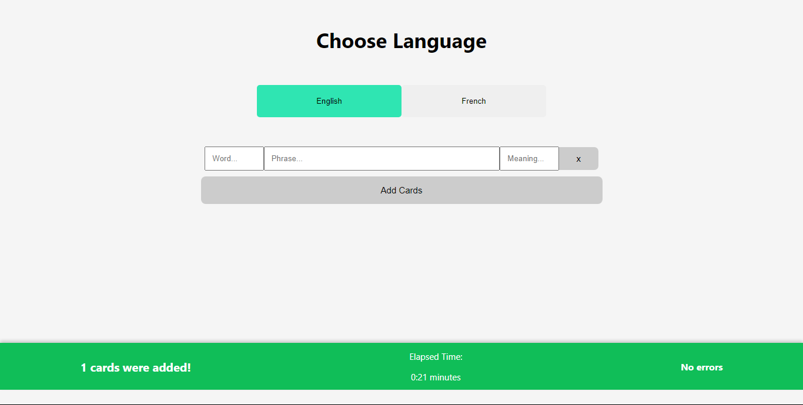

# Ankimate

### Description	

 	

​	This is a react project that automates the process of getting phrases, context, phonetics and audio voice in order to creat languague studying flash cards on Anki. It runs on localhost for the time being and through Puppeteer it fetches data from Word refence dictionary.

[Wordrefence]: https://www.wordreference.com/

### Card output example	

### Instructions

​	In order to start the server, go to root folder and run 'npm run dev' on a terminal. Then go to http://localhost:3000/ to get to the app homepage. There, pick a deck, add the words you want to make a card of. Both meaning and phrase fields are optional, if empty the app will try to fetch it on the dictionary website.

​	Currently, the project supports English and French language input to Brazilian Portuguese output. The cards are added to the decks with the name of 'English' or 'French'.

​	Since the web scrape uses a browser, the app performance may depend on your computer specs.

​	This app requires Ankiconnect extension in order to access Anki software API.	

[Ankiconnect]: https://ankiweb.net/shared/info/2055492159

### Features to be added

​	Since this is a project for personal use, there are a few small improvements I'm working on. Deck selection, dark mode, detailed log notification but my main is to improve the code performance and readability. I know it has lots of flaws but this is a personal project and it works just fine for me right now. Any help to improve this app is appreciated.